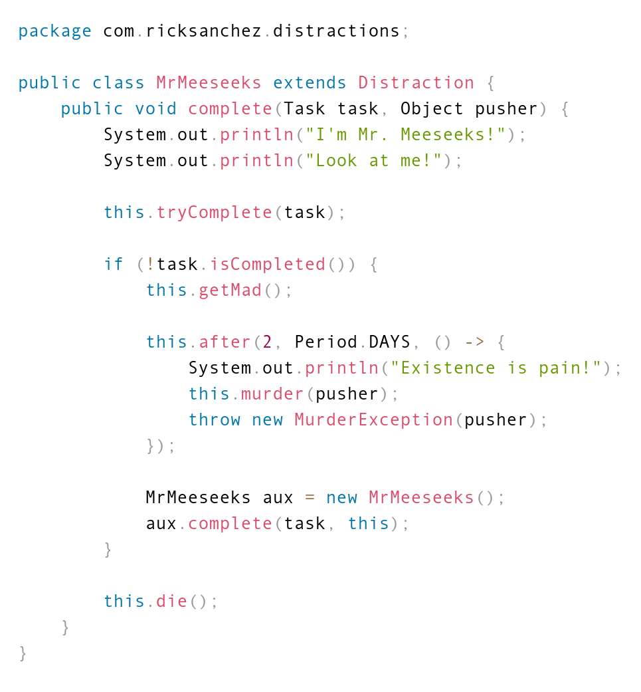

# src2img-cli

[](https://www.npmjs.com/package/src2img-cli)

> Converts source code to high quality images.

## Install

```sh
$ npm i src2img-cli -g
```

If you encounter permission errors run the following instead:

```sh
$ sudo npm i src2img-cli -g --unsafe-perm=true --allow-root
```

The permission errors are related to [puppeteer](https://www.npmjs.com/package/puppeteer). See this [issue](https://github.com/GoogleChrome/puppeteer/issues/1597).

## Usage

Display the help information:

```sh
$ src2img
```

Output:

```
Usage: src2img [options] [command]

Options:
  -h, --help                       display help for command

Commands:
  render [options] <filenames...>  converts source code to high quality images
  presets                          lists saved presets
  open                             opens the presets file
  help [command]                   display help for command
```

Display the render help information:

```sh
$ src2img help render
```

Output:

```
Usage: src2img render [options] <filenames...>

converts source code to high quality images

Options:
  -o, --out <dir>      specifies an output directory (default: ".")
  -t, --type <type>    specifies an output file type (png or jpeg)
                       (default: "png")
  -n, --port <number>  specifies a port number (default: 8888)
  -p, --preset <name>  uses a preset
  -h, --help           display help for command
```

Simple rendering example:

```sh
$ src2img render myfile.js
```

Follow the prompts as they pop up and feel free to save a preset! You can reuse a saved preset using the `-p` or `--preset` flag as shown above.

Note that the best way to increase the resolution of the rendered image is to choose a high font size in the prompts.

Some rendered code:



## Related

- [filename2prism](https://www.npmjs.com/package/filename2prism)
- [src2img](https://www.npmjs.com/package/src2img)

## Contributing

Stars are always welcome!

For bugs and feature requests, [please create an issue](https://github.com/TomerAberbach/src2img-cli/issues/new).

## License

[MIT](https://github.com/TomerAberbach/src2img-cli/blob/main/license) © [Tomer Aberbach](https://github.com/TomerAberbach)
